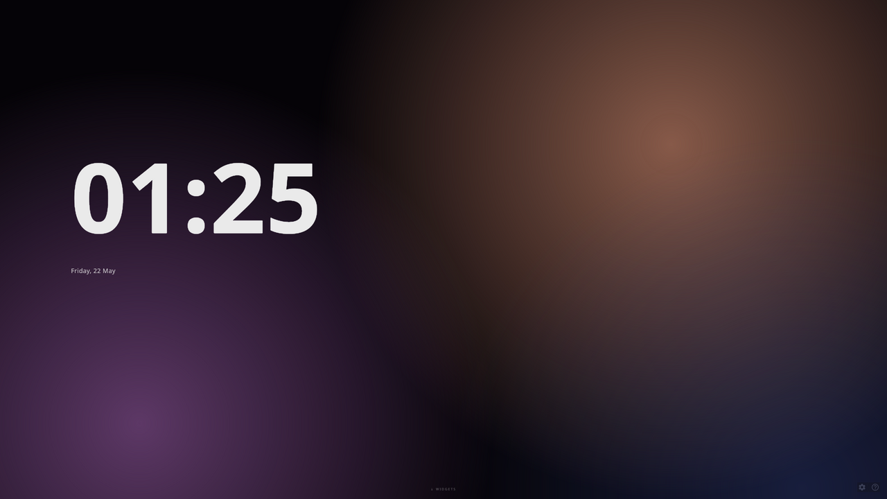
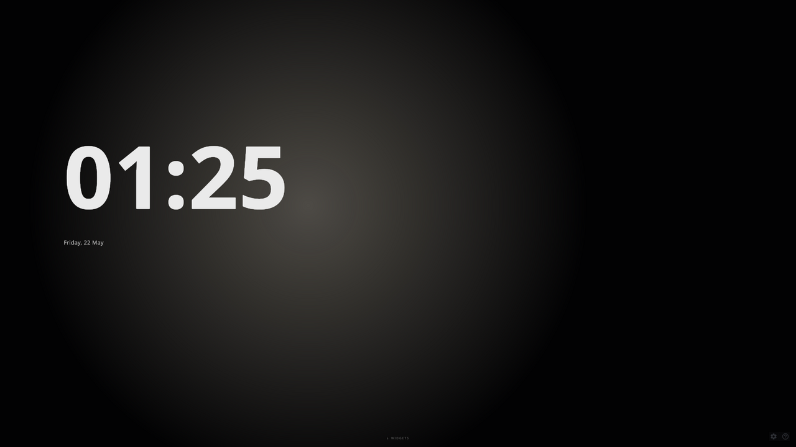
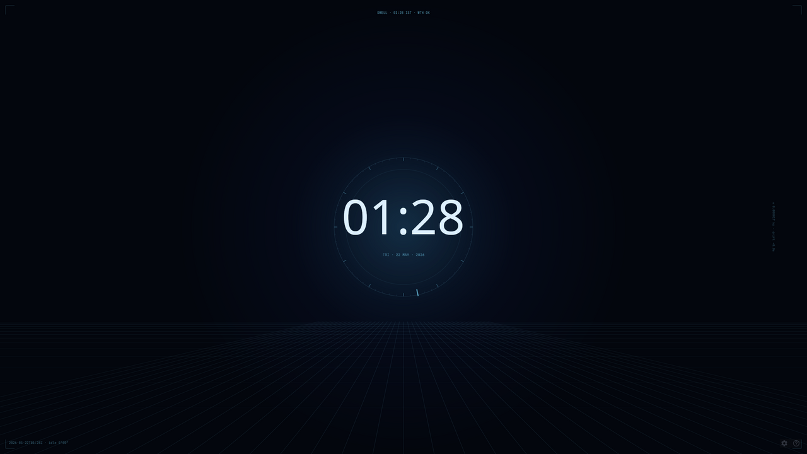
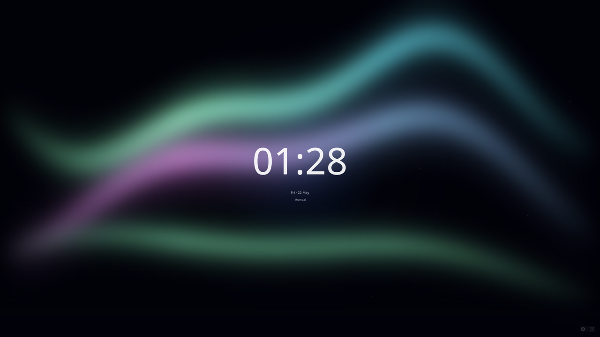
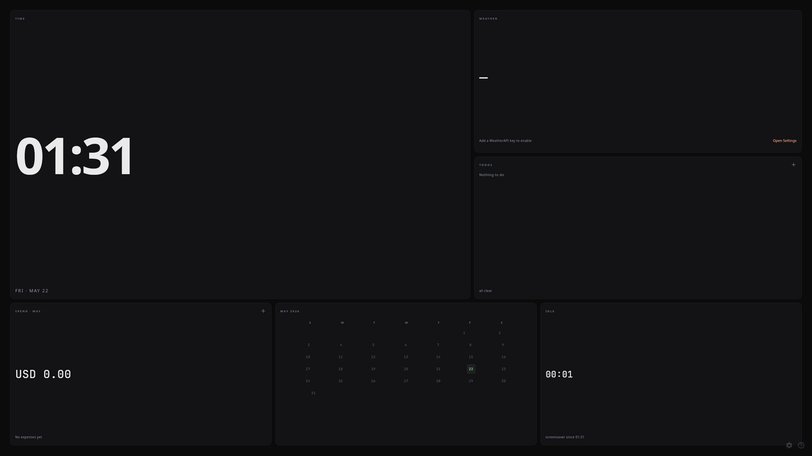
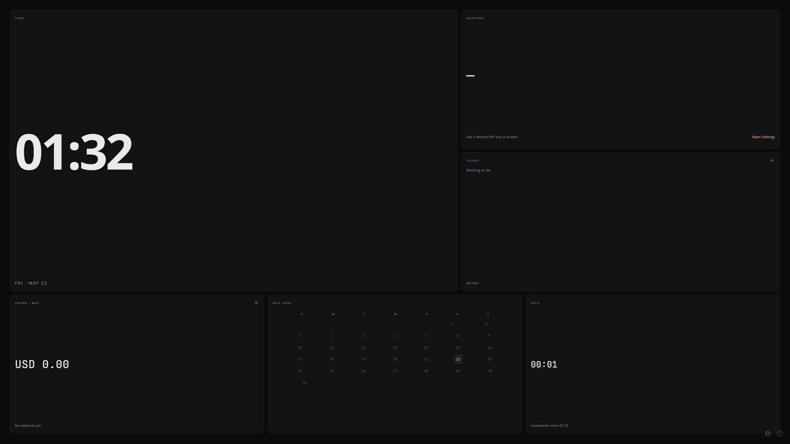

# Dwell

> Dwell is the codename and primary identifier for this project. (Installer artifacts may still say *Screen Saver App* until the next release rolls.)

A calm, three-mode desktop screensaver that fades in after the OS goes idle, then renders a clock, weather, todos, expenses, and any widgets you drop into `~/.screensaver/widgets/`. Tray daemon on Linux and Windows; Compose Multiplatform under the hood.



## Quick start (from source)

```sh
git clone https://github.com/priyanshu0x/dwell.git
cd dwell
./scripts/dwell show     # macOS / Linux
scripts\dwell.cmd show   :: Windows
```

The CLI auto-installs Temurin JDK 21 to `~/jdks/` on first run (no `JAVA_HOME` setup required). The first build downloads ~200MB of Gradle dependencies and takes 1–2 minutes; subsequent launches are seconds.

### CLI commands

| Command | What it does |
|---|---|
| `dwell show` | Build current source, pause the registered daemon on Linux/macOS, then open the production dashboard. |
| `dwell daemon` | Run as a tray daemon — dashboard appears after idle timeout. |
| `dwell config` | Open the dashboard with Settings pre-opened. |
| `dwell dev` | Compose Hot Reload dev mode; skips daemon/tray/idle plumbing. |
| `dwell build` | Compile without launching (CI / verification). |
| `dwell install` | Symlink the CLI into `~/.local/bin` so you can type `dwell …` from anywhere. |
| `dwell uninstall` | Remove the symlink. |
| `dwell status` | Show whether Dwell is running + which JDK / settings file is in use. |

> On Windows substitute `scripts\dwell.cmd` for `./scripts/dwell`. The install subcommand drops a `dwell.cmd` shim in `%USERPROFILE%\bin`.
> Add `--debug` or set `DWELL_DEBUG=1` to show Gradle/Kotlin build output; normal launches keep it in the launcher log.

Use `dwell dev` while iterating on UI. Use `dwell show` when you need the production entrypoint from source; it must build the current checkout and should not reuse an already-running daemon window.

## Three modes

Press `M` to cycle, `1` / `2` / `3` to jump directly, `V` to cycle variants within a mode.

### Cinematic — default

Animated mesh-gradient backdrop with a huge typographic clock anchored upper-left. Variants: **Dusk** (peach / violet) and **Noir** (warm-white drifting glow on near-black). Hover the bottom edge or press `W` to peek a widget drawer.

| Dusk | Noir |
|---|---|
|  |  |

### Ambient — calm presence

Two variants:

- **Lumen** — sci-fi HUD: cyan corner brackets, perspective grid floor, telemetry strips along three edges, an orbital dial with a pulsing current-minute tick, and a thin Inter Tight clock with a soft cyan glow. Toggle "Quieter Lumen" in Settings → Display to strip back to the clock + a single telemetry line.
- **Borealis** — soft aurora ribbons drifting across a starlit deep-night sky with the clock floating in the middle.

| Lumen | Borealis |
|---|---|
|  |  |

### Console — modular dashboard

Every enabled widget visible at once on a 12×6 grid. Press `L` to enter **Edit Layout** mode — drag tile headers to reorder, drag corners to resize. Layout is per-widget and persists in `~/.screensaver/settings.json`. Variants change only the accent: **Standard** uses a terminal-green `#9ECDA0`, **Amber** uses a vintage-CRT `#F3B95E`.

| Standard | Amber |
|---|---|
|  |  |

## Controls

| Key | Action |
|---|---|
| `Esc`, `Alt`, mouse-move, any key (configurable) | Dismiss dashboard to tray |
| `Ctrl+Alt+Space` | Show dashboard from tray (Windows) |
| `Ctrl+Q` / `Cmd+Q` | Quit application |
| `Ctrl+,` | Open Settings sheet |
| `F1` / `?` | Help dialog |
| `M` | Cycle mode |
| `1` / `2` / `3` | Jump to Cinematic / Ambient / Console |
| `V` | Cycle variant within current mode |
| `W` | Toggle widget drawer (Cinematic only) |
| `L` | Toggle layout edit mode (Console only) |
| `Ctrl+R` | Reload widgets from `~/.screensaver/widgets/` |

## Widgets

Built-in widgets ship with Dwell: Clock, Weather (current conditions), Weather Forecast (5-day, opt-in), Todos, Expenses, Calendar (month grid), Idle Counter (Console-only).

Drop your own widgets into `~/.screensaver/widgets/`:

- **Kotlin/JVM widgets** — implement `com.droidslife.screensaver.widget.api.WidgetFactory`, package as a JAR with a `META-INF/services/com.droidslife.screensaver.widget.api.WidgetFactory` entry, copy the JAR into `~/.screensaver/widgets/`.
- **Declarative widgets** — drop a folder containing `widget.yaml` into the same directory.

See [`docs/widget-authors.md`](docs/widget-authors.md) and the worked samples in [`samples/`](samples/) for the full guide.

Reload installed widgets via the tray menu, Settings → Widgets → Reload, or `Ctrl+R` in the dashboard.

## Settings

Open with `Ctrl+,` (or the gear icon at the bottom-right of the dashboard). Tabs:

- **Display** — Mode (Cinematic / Ambient / Console), variant picker (per mode), clock format (12/24h), show-seconds, show-date.
- **Widgets** — enable/disable each widget, per-widget config, "Edit Console layout" entry point.
- **Triggers** — idle timeout, start-with-system, mouse-movement dismiss, exit-on-keypress.
- **Sync** — optional backend (off by default; nothing leaves your machine unless you turn it on).
- **About** — version, license, links.

City selection lives inside the Weather widget itself (not in global Settings).

## Weather setup

The Weather and Weather Forecast widgets call [WeatherAPI.com](https://www.weatherapi.com/) (free tier, ~1M calls/month). To enable:

1. Sign up for a free account at <https://www.weatherapi.com/signup.aspx>.
2. Copy your API key from the WeatherAPI dashboard.
3. Open Dwell → Settings → Widgets → Weather → paste the key.

Alternatively, export `WEATHERAPI=<your-key>` in the environment before launching.

Without a key, the Weather widget shows a friendly "Add a WeatherAPI key" empty state with an Open Settings link.

## Privacy

Dwell does not phone home. Optional backend sync (Settings → Sync) is **off by default**. Weather requests go directly to WeatherAPI.com if you've configured a key — nothing else leaves your machine.

Local data:

- `~/.screensaver/settings.json` — preferences (mode, variant, idle timeout, widget enable list).
- `~/.screensaver/widget-data/<widget-id>/` — per-widget local storage.
- API keys are stored in the OS keychain when possible (Windows Credential Manager, Linux `secret-tool`/libsecret) or an obfuscated fallback file otherwise.

## Linux notes

Idle detection backends Dwell can use, in preference order:

- **GNOME Wayland** — `gdbus` (already shipped with GNOME).
- **X11** — XScreenSaver / libXss. Install: `sudo apt install libxss1`.
- **Fallback** — `xprintidle`. Install: `sudo apt install xprintidle`.

If the tray icon doesn't appear on GNOME, install the *AppIndicator and KStatusNotifierItem Support* extension — GNOME removed legacy tray support in 3.26.

## Build from source

```sh
./scripts/dwell build     # compile only
./scripts/dwell show      # compile + launch production path, pausing the daemon first
```

The build is driven by Gradle. Native installers are produced by:

```sh
./gradlew :composeApp:packageDistributionForCurrentOS    # MSI/EXE on Win, DEB on Linux
./gradlew :composeApp:packageScrZip                      # Windows .scr bundle (run on Windows)
```

See [`docs/packaging.md`](docs/packaging.md) for installer details and [`docs/troubleshooting.md`](docs/troubleshooting.md) for common issues.

## Repo layout

```text
composeApp/                       desktop application
widget-api/                       public widget API (Render targets, WidgetSize, GridRect)
samples/sample-kotlin-widget      JAR widget sample
samples/sample-declarative-widget widget.yaml sample
scripts/dwell, dwell.cmd          launch CLI (bash + Windows)
docs/                             packaging + widget-authoring + troubleshooting docs
plans/                            implementation plans
```

## License

MIT (see `LICENSE`). © 2026 DroidsLife.
